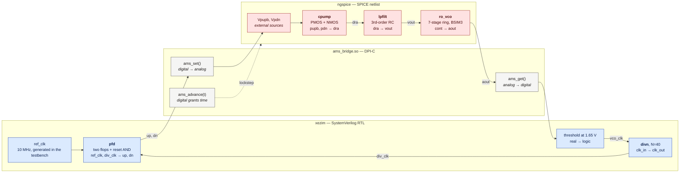

# ams-cosim

Run a SPICE netlist in **ngspice** and SystemVerilog RTL in **xezim**, in
lockstep, with values crossing between them every timestep.

Neither simulator was modified. The bridge is a DPI-C library that xezim
`dlopen`s, driving `libngspice` through the synchronisation callbacks
`ngSpice_Init_Sync` exists for.

## The system, and where the boundary falls

The PLL is one loop, cut in two. The VCO, the charge pump and the loop
filter are transistor-level SPICE; the phase detector and the divider are
ordinary RTL. Neither half is a model of the other.



### The two crossings

Everything else stays on its own side. These are the only places the two
simulators touch:

| direction | signal | how |
|---|---|---|
| digital &rarr; analog | `up`, `dn` &rarr; `pdn`, `pupb` | `ams_set()` writes two `external` voltage sources |
| analog &rarr; digital | `aout` &rarr; `vco_clk` | `ams_get()` reads the node; the testbench thresholds it at 1.65 V |

`up` drives `pdn` **active high**; `dn` drives `pupb` **active low** (a PMOS
gate). That polarity was derived from a measured Kvco sign and measured
per-state pump currents, not from the port names &mdash; with a negative
Kvco, UP must select the *sinking* control, which is the opposite of the
textbook wiring.

### What runs where

| block | lives in | why |
|---|---|---|
| ring VCO, charge pump, loop filter | ngspice | transistor-level; the thing being characterised |
| phase detector, divider | xezim | already RTL in any real design |
| reference clock | xezim | a testbench stimulus, not part of the design |
| time | xezim | the digital side grants the analog a window and waits |

## Why

Analog-mixed-signal designs are usually partitioned the same way: the
analog comes from schematic into SPICE, the digital is already RTL. Each
half can be simulated alone, and each half passing says nothing about the
loop they form — a sign error at the boundary passes every block-level
check and only shows up when the loop is closed.

This produces the reference that closing the loop needs, for people who do
not have a commercial AMS simulator.

## Result

`examples/pll` — a PLL whose VCO, charge pump and loop filter are
transistor-level SPICE and whose detector and divider are ordinary RTL:

```
PLL t= 4000 ns  vctrl=1.8564 V  net -120    overshoot recovering
PLL t= 6000 ns  vctrl=1.8446 V  net +136    undershoot
PLL t=12000 ns  vctrl=1.8475 V  net  +45    settled
PLL t=18000 ns  vctrl=1.8475 V  net  +24    holding
PLL f_vco = 400.00 MHz over 4900.0 ns  (target 400.00 MHz)
```

400.00 MHz is exactly 40x the 10 MHz reference — which is what says
LOCKED, rather than merely quiet. The residual `net +24` of UP is the
static phase error such a loop sits at, not noise. 20 us in 2 min 22 s.

(The committed example runs 3 us so it finishes while you watch; the figures
above are the 20 us run.)

## Requirements

- **a shared `libngspice`.** The ordinary CLI binary will not do — this
  links `libngspice.so`. Either shape works and `build.sh` finds both:

  ```sh
  sudo apt-get install libngspice0-dev     # the easy one
  ```

  The examples are pure analog — no XSPICE code models — so a stock package
  is enough. Tested against Debian/Ubuntu's 45.2 as well as a 46 source
  tree.

  Or build one, if you want a specific version or XSPICE for your own decks.
  Configure a SECOND copy of the source: ngspice refuses to configure a tree
  that is already configured, and reusing the one that built the CLI
  destroys it.

  ```sh
  cp -a ngspice-46 ngspice-46-shared && cd ngspice-46-shared
  make distclean
  ./configure --with-ngshared --enable-xspice --disable-debug
  make -j$(nproc)
  ```

  Search order is `NGSPICE_LIB`+`NGSPICE_INC` (an explicit pair, for an
  unusual layout), then `NGSPICE_SRC` as a source tree, then whatever the
  loader knows about.

- **xezim**, built. `XEZIM` names the BINARY, not the checkout directory.

  It must include [xezim-core#42](https://github.com/aionhw/xezim-core/pull/42),
  which is open at the time of writing — `examples/pll/pfd.sv` writes its
  reset delay as `300ps`, and without that fix the constant folds to `0.3`
  and rounds to zero, giving the PFD a silent zero-width reset. `run_tests.sh`
  refuses to run against a xezim that gets this wrong rather than passing
  with a subtly broken loop; the message tells you both ways out. The
  workflow builds against that PR until it merges.

## Use

```sh
export XEZIM=~/xezim/target/release/xezim
# and, only if libngspice is not already on the loader's path:
export NGSPICE_SRC=~/ngspice-46-shared

./build.sh              # just build ams_bridge.so
./build.sh rc           # the lockstep check      (~1 s)
./build.sh pll          # the PLL                 (~17 s at 3 us)

./tests/run_tests.sh    # both, with a verdict    (~17 s)
./tests/run_tests.sh rc # plumbing only           (~1 s)
```

With no toolchain present the gate prints `VERDICT: SKIP` and exits 0, which
is right on a laptop and wrong in CI — a green tick that only means "ngspice
was not installed" is worse than no CI at all. `STRICT=1` turns that skip
into a failure, and [the workflow](.github/workflows/ci.yml) sets it.

Both examples are gated, and they check different things. The RC checks the
PLUMBING — that the two simulators are actually in step. The PLL checks the
OUTCOME, which is a separate question: every part of the plumbing can work
while the loop is wired backwards, and it will still run, still print, and
still look like a PLL. So the PLL testbench asserts that the VCO oscillates
at all, that the control voltage has not run to a rail, and that the output
settles at N x the reference.

## Waveforms

`./build.sh pll` leaves three files in `examples/pll/`:

| file | what | read with |
|---|---|---|
| `pll_analog.raw` | ngspice's native rawfile — 6 vectors, ~145k timepoints | `ngspice -r`, gaw, numpy |
| `pll_digital.vcd` | the RTL signals | GTKWave, Surfer |
| `pll_combined.vcd` | **both, on one timeline** | GTKWave, Surfer |

No viewer reads an ngspice rawfile and a VCD together, so `tools/raw2vcd.py`
converts and interleaves them. **Nothing is resampled**: a VCD timestamp is
an arbitrary integer rather than a grid, so each of ngspice's own timepoints
becomes one, carrying the node voltage as a `real`. The solver chooses those
timepoints by its own error control — they are neither uniform nor the
coupling ticks — and forcing them onto the digital grid is the step that
would turn a real waveform into a plausible-looking one. Output timescale is
1 fs so no analog point has to round onto another.

```sh
tools/raw2vcd.py examples/pll/pll_analog.raw \
    --merge examples/pll/pll_digital.vcd -o combined.vcd
gtkwave combined.vcd
```

The merge is checked rather than admired. `tests/check_waves.py` requires
the two simulators to report the **same VCO edge count** from their own
files — 1159 threshold crossings in the rawfile against 1160 rising edges in
the VCD, one apart because the run ends mid-cycle. They are produced by
different simulators on different time grids, so agreement is real evidence
the coupling held; a drift would show there and nowhere else. It also
requires the merge to reproduce both counts exactly, and no analog signal to
share a VCD identifier with a digital one.

## What the coupling costs

The digital side squares the VCO output by reading `v(aout)` every coupling
tick and comparing it to a threshold, which quantises every edge onto the
tick grid. That is the first thing anyone asks about a polled
analog-to-digital crossing, so it is measured rather than argued about —
the rawfile holds where the crossing really was, at ngspice's own
timepoints, so the artifact is a subtraction.

`tests/check_coupling_jitter.py`, on the shipped example (100 ps tick,
20 ps analog step, ~400 MHz VCO):

```
  mean    58.0 ps   <- sampling LAG
  stdev   29.6 ps   <- sampling JITTER
  max    119.8 ps   <- one tick plus one analog step

  per VCO edge           : 4.24 deg rms
  on the /40 feedback edge: 0.0296 % of the 100 ns reference
```

Those are the numbers uniform quantisation predicts: a lag of about half a
tick and a jitter of tick/sqrt(12) = 28.9 ps. The check requires the
measurement to MATCH that prediction, because agreement means the mechanism
is understood. A number outside it would mean something else was happening
— the analog running ahead, an edge missed, a threshold crossed twice — and
those have very different consequences.

The `max` bound is one tick **plus one analog step**, not one tick:
`ams_get` returns ngspice's most recently computed value, which can be up
to one of its own steps stale. 119.8 ps against 100 + 20 is exactly that.

### So what is this good for

| use | verdict |
|---|---|
| lock, capture range, settling | fine — 0.03% of the reference period after the divider |
| loop dynamics, stability, sign errors | fine — this is what it is for |
| **jitter, phase noise, spurs** | **no** — the coupling injects ~30 ps rms of its own, which is the same order as a real PLL jitter budget |

To narrow the artifact, shrink the tick: the lag and jitter fall linearly
with it. The cost is linear too, because the analog is granted a window per
tick.

## Writing your own

The analog side declares whatever the digital drives as an `external`
source, and **leaves its dc value at zero** — an `external` source's `dc`
ADDS to what the callback returns, so `dc {vcc}` with a callback returning
3.3 puts the node at 6.6 V:

```
Vdrv in 0 dc 0 external
R1 in out 1k
C1 out 0 1n
```

The digital side owns time. It grants the analog a window, exchanges
values, and repeats:

```systemverilog
import "DPI-C" function int  ams_open(input string deck);
import "DPI-C" function int  ams_drive(input string node, input real init);
import "DPI-C" function int  ams_start(input real tstep, input real tstop);
import "DPI-C" function int  ams_set(input string node, input real v);
import "DPI-C" function int  ams_advance(input real t_seconds);
import "DPI-C" function real ams_get(input string node);
import "DPI-C" function real ams_time();
import "DPI-C" function int  ams_done();
import "DPI-C" function void ams_close();
```

```systemverilog
always @(posedge tick) begin
  rc     = ams_advance($realtime * SEC_PER_TICK);  // let the analog catch up
  v_out  = ams_get("out");                          // analog -> digital
  rc     = ams_set("vdrv", drive ? VDD : 0.0);      // digital -> analog
end
```

## How the coupling works

xezim is the master and ngspice the slave, because that is the only
direction the two can be driven: xezim calls out through DPI-C and has no
library mode or resume entry point, while libngspice exposes exactly the
hooks for being driven.

libngspice runs its transient on ITS OWN thread (`bg_tran`), so the two
genuinely run concurrently and something has to stop the analog running
ahead. `GetSyncData` is the one hook for it — ngspice calls it inside
`dctran` with the time it has reached and a pointer to the step it intends
to take next:

```
digital calls ams_advance(t)  ->  "you may run up to t"
GetSyncData clamps the next step so it cannot pass t, and blocks on arrival
ams_advance returns once ngspice reports it reached t
```

`GetVSRCData` is deliberately NOT a synchronisation point. ngspice calls it
once per Newton iteration, several times per timestep, and blocking there
deadlocks against its own solver. It returns the last value the digital
side wrote, which is the right semantics: a source holds its value across
the step being solved.

## Things that cost time, none of which failed loudly

Each of these ran and printed numbers that looked plausible.

**An `external` source's `dc` value adds to the callback's** — see above.
The rail sat at twice its value and everything downstream simply scaled.

**Clamping the timestep to the granted window squeezes it to death.** As
ngspice approaches the limit the remaining room shrinks, the clamp shrinks
the step with it, and the two chase each other down until ngspice reports
`Timestep too small; timestep = 8.8e-25` and aborts. There is a floor now
(`AMS_MIN_STEP_S`): below it, stop clamping and let the analog overshoot by
at most one of ITS steps, which the block catches on the next call. That
bounds the error at one analog timestep — far under the digital tick that
granted the window — and unlike the squeeze it cannot fail.

**The coupling tick must beat Nyquist on the fastest analog signal.**
`always #(STEP) clk = ~clk;` gives a posedge every `2*STEP`, so a tick
meant to be 100 ps was 20 ns; the reference ran at 50 kHz and a 400 MHz
ring read as a confident 124 MHz.

**A time literal in a constant is scaled to a fixed 1 ns on xezim, not to
the module's `timescale`.** IEEE 1800-2017 §5.8 says a time literal is
"scaled to the current time unit", with no exemption for constant
expressions. On xezim 0.10.5 a literal in a `localparam`, `const`,
parameter port or module-level variable initialiser is divided by 1 ns, and
the result is then used as a count of the module's *own* unit. Run-time
evaluation — procedural assignment, automatic variable init, `#100ns` —
is correct. Same module body, three timescales, all intending 100 ns:

| module time unit | folded | delay | |
|---|---|---|---|
| `1ns` (no directive — the default) | `100` | 100 ns | right |
| `1ps` | `100` | 100 ps | 10³ short |
| `1fs` | `100` | 100 fs | 10⁶ short |

Two consequences worth internalising. The error is the ratio `1ns / unit`,
so a module that declares **no** timescale is accidentally correct — which
is why this hides. And sub-nanosecond delays do not shrink, they vanish:
under `1ps/1ps`, `localparam realtime D = 300ps` folds to `0.3`, which
rounds to zero at the module's precision, so the delay disappears
completely.

That is what bit here. A tick constant is a `localparam`; believing the
suffix asked the analog to advance to 3.5e-11 s — it never moved, every
reading came back `0.000000`, and the digital clock looked frozen at zero
while running perfectly normally. Filed as
[aionhw/xezim#161](https://github.com/aionhw/xezim/issues/161), fixed in
[xezim-core#42](https://github.com/aionhw/xezim-core/pull/42).

Every *tick* constant in these testbenches is still a BARE number in
timescale units, which sidesteps the bug rather than depending on which side
of it an expression falls. `examples/pll/pfd.sv` is the exception: its reset
delay is written `300ps`, because that is what the file should say and a
30-line PFD is not the place to explain a simulator bug. That one line is
why the gate checks for the fix before it runs — see below.

## What this is not for

Speed. The analog side is transistor-level SPICE and sets the pace: 20 us
of PLL is 2.5 minutes. This produces a reference; it is not a per-change
verification loop. Behavioural models exist for that, and this is how you
find out whether one of them is right.

## Licence

Apache-2.0 — see [LICENSE](LICENSE).

What this links to matters more than usual, because the bridge is a shared
library loaded into a simulator:

| | licence | what it means here |
|---|---|---|
| this repo | Apache-2.0 | permissive, with an explicit patent grant |
| **ngspice** | Modified BSD for the source, with a few narrowly-scoped exceptions listed in its own `COPYING` | permissive; linking `libngspice` carries attribution, not copyleft |
| **xezim** | Apache-2.0 | the bridge is `dlopen`ed by it, not linked into it |

So nothing here obliges a downstream user to open their own work. That is
deliberate: this exists to sit inside somebody's verification flow, and a
copyleft licence on a library loaded into a simulator would make that a
question for their legal team rather than their CAD team.

Neither simulator is modified or redistributed by this repo — it builds
against them.

None of the above is legal advice; check the upstream licence files
yourself before adopting it. ngspice's exceptions in particular are worth
reading if you redistribute a built `libngspice`.

## Layout

| path | what |
|---|---|
| `src/ams_bridge.c` | the DPI library |
| `examples/rc/` | smallest circuit that proves lockstep. tau = 1 us, drive toggled every 5 tau, so the capacitor must reach within 0.67% of the rail — checkable, not impressionistic |
| `examples/pll/` | the loop: analog partition, plus an ordinary RTL detector and divider |
| `tools/raw2vcd.py` | ngspice rawfile to VCD, and merges with the digital dump. Nothing is resampled |
| `tests/run_tests.sh` | both examples as a gate; skips when the toolchain is absent |
| `tests/check_waves.py` | the waveform files, checked against numbers rather than looked at |
| `tests/check_coupling_jitter.py` | what the coupling costs in edge timing, measured against what quantisation predicts |
